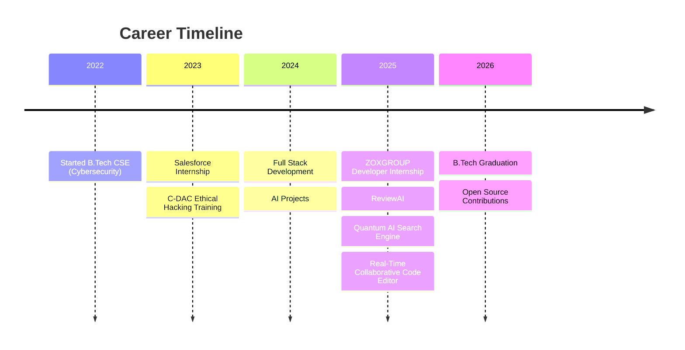

# Kunal Kumar

 

 

---

# 💫 About Me

<table>
<tr>

<td width="60%">

## 👨‍💻 Who Am I?

I'm **Kunal Kumar**, a passionate **Full Stack Developer, AI Developer and Cybersecurity Engineer** from India.

I enjoy building scalable web applications, AI-powered products, developer tools and secure software solutions.

🎓 **B.Tech Computer Science & Engineering (Cybersecurity)**

🏫 Government Engineering College West Champaran

💡 Passionate about

- Artificial Intelligence
- Full Stack Development
- Cyber Security
- Cloud Computing
- Open Source

🚀 Currently working on

- AI Powered Code Review Platform
- Quantum AI Search Engine
- Real-Time Collaborative Code Editor

Always exploring new technologies and solving real-world problems through code.

</td>

<td width="40%" align="center">

</td>

</tr>
</table>

---

# 👨‍💻 Personal Information

| Information | Details |
|-------------|---------|
| 👤 Name | **Kunal Kumar** |
| 🎓 Degree | B.Tech Computer Science & Engineering (Cybersecurity) |
| 🏫 College | Government Engineering College West Champaran |
| 📈 CGPA | **7.5 / 10** |
| 📧 Email | **kunalk9521@gmail.com** |
| 📱 Phone | **+91 9470851757** |
| 🌍 Country | India |
| 💼 Role | Full Stack Developer |
| ❤️ Interests | AI, Web Development, Cyber Security |

---

# 🛠 Tech Stack

### Languages

### Frontend

### Backend

### AI & Cloud

---

# 🚀 Featured Projects

## 💻 Real-Time Collaborative Code Editor

✔ Multi-user editing

✔ WebSockets

✔ Secure Authentication

✔ Auto Save

✔ Session Management

---

## 🤖 ReviewAI

AI-powered Code Review Platform

- Next.js
- TypeScript
- AI APIs
- TailwindCSS

---

## 🔍 Quantum

AI Powered Search Engine

- AI Generated Summaries

- Intelligent Search

- Modern UI

---
# 💼 Professional Experience

<table align="center">
<tr>

<td width="33%" valign="top">

## 🏢 ZOXGROUP

### Developer Intern

📅 **Dec 2025 – Mar 2026**

- Selected for a 3-month Technical Developer Internship.
- Worked on scalable web applications.
- Collaborated with developers and designers.
- Improved frontend and backend development skills.
- Participated in Agile software development.

</td>

<td width="33%" valign="top">

## ☁ Salesforce

### Developer Intern

📅 **Dec 2023 – Jan 2024**

- Worked on Salesforce platform development.
- Learned Lightning Components.
- Developed cloud-based solutions.
- Collaborated with industry professionals.
- Improved CRM and cloud computing knowledge.

</td>

<td width="33%" valign="top">

## 🔐 C-DAC

### Ethical Hacking & Penetration Testing Trainee

📅 **Oct 2023 – Nov 2023**

- Completed Cyber Gyan Project.
- Learned Penetration Testing.
- Performed Vulnerability Assessment.
- Practiced Network Security.
- Hands-on Ethical Hacking tools.

</td>

</tr>
</table>

---

# 📈 Career Journey

---

# 🏆 Certifications

| Certificate | Provider |
|-------------|----------|
| Ethical Hacking & Penetration Testing | C-DAC |
| Salesforce Developer Internship | Salesforce |
| Networking & Cyber Security | Cisco |
| Full Stack Web Development | Self Learning |
| HTML, CSS & JavaScript | IIT Bombay |
| Linux Security | Udemy |

---

# 📊 GitHub Analytics

 

---

# 🌱 Currently Learning

- Artificial Intelligence
- Machine Learning
- Cloud Computing
- Advanced React
- Next.js 15+
- Cyber Security
- DevOps
- Docker
- Azure
- System Design

---

# 🤝 Open To

✅ Full Stack Developer Roles

✅ Software Engineer Roles

✅ AI Developer Roles

✅ Cyber Security Opportunities

✅ Freelancing

✅ Open Source Collaboration

---

# 📬 Contact & Social

---

# 💡 Quote

 

---

# ⭐ Support My Work

If you like my projects, consider giving them a ⭐.

---

<!--  -->

### Thanks for visiting my profile ❤️

⭐ Have a great day! ⭐

